# 🏨 Hotel Booking System (Python OOP Project)

A command-line **Hotel Booking System** built in Python to demonstrate core **Object-Oriented Programming (OOP)** principles — encapsulation, composition, and object interaction — through a real-world domain: managing hotel rooms, customers, bookings, cancellations, and billing.

> Repository: [Hotel-Management-System-using-OOPs](https://github.com/KARTIK-KUMAR-SINGH/Hotel-Management-System-using-OOPs)

---

## 📌 Table of Contents

- [Overview](#-overview)
- [Tech Stack](#-tech-stack)
- [Project Structure](#-project-structure)
- [System Architecture](#-system-architecture)
- [Core Classes & Relationships](#-core-classes--relationships)
- [Class Diagram](#-class-diagram)
- [Application Flow (CLI Menu)](#-application-flow-cli-menu)
- [Feature Flows](#-feature-flows)
  - [Add Room](#1-add-room)
  - [Register Customer](#2-register-customer)
  - [View Available Rooms](#3-view-available-rooms)
  - [Book Room](#4-book-room)
  - [View Bookings](#5-view-bookings)
  - [Cancel Booking](#6-cancel-booking)
  - [Generate Bill](#7-generate-bill)
  - [Exit](#8-exit)
- [OOP Concepts Demonstrated](#-oop-concepts-demonstrated)
- [Current Limitations](#-current-limitations)
- [Future Roadmap](#-future-roadmap)
- [Getting Started](#-getting-started)
- [Contributing](#-contributing)
- [Author](#-author)
- [License](#-license)

---

## 🧭 Overview

The **Hotel Booking System** manages the end-to-end lifecycle of a hotel booking — from registering rooms and customers, to booking, cancelling, and generating bills — entirely through a **Command-Line Interface (CLI)**.

The project's primary goal is educational: to demonstrate clean **OOP design** (classes, objects, composition, encapsulation, and separation of responsibilities) rather than to be a production-ready booking platform. Data is currently stored **in-memory** and is not persisted between runs.

---

## 🛠 Tech Stack

| Component | Technology |
|---|---|
| Language | Python |
| Paradigm | Object-Oriented Programming (OOP) |
| Interface | Command-Line Interface (CLI) |
| Data Storage | In-memory (Python lists) |
| Database | ❌ Not yet integrated |
| Web Framework | ❌ FastAPI not yet integrated |
| Frontend | ❌ Not yet built |

---

## 📁 Project Structure

```
hotel_booking/
│
├── main.py                 # CLI entry point — handles user interaction
│
└── models/
    ├── customer.py          # Customer class
    ├── room.py               # Room class
    ├── booking.py            # Booking class (composition of Customer + Room)
    └── hotel.py               # Hotel class — core business logic
```

---

## 🏗 System Architecture

The current architecture is a simple layered design where the CLI talks directly to the business logic layer (`Hotel`), which in turn manages the domain objects (`Customer`, `Room`, `Booking`).

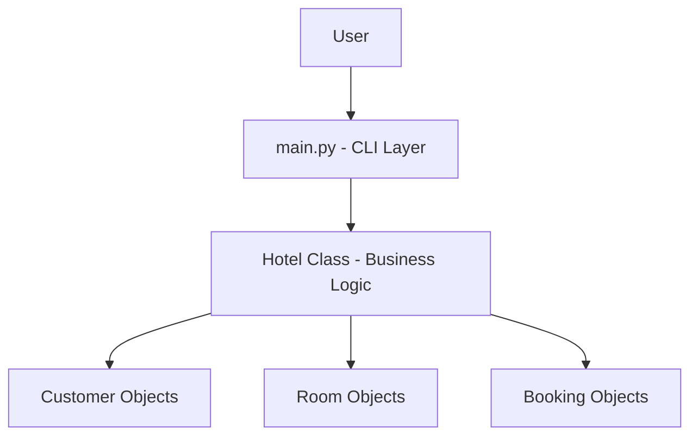

---

## 🔗 Core Classes & Relationships

### 1. `Customer`
Represents a hotel customer.

| Attribute | Description |
|---|---|
| `name` | Customer's name |
| `customer_id` | Unique identifier |
| `phone_number` | Contact number |

### 2. `Room`
Represents a hotel room.

| Attribute | Description |
|---|---|
| `room_number` | Unique room identifier |
| `room_type` | Type/category of room |
| `price` | Price per night |
| `is_available` | Tracks current booking status |

### 3. `Booking`
Represents a booking made by a customer. This class demonstrates **object composition** — a `Booking` **HAS-A** `Customer` and **HAS-A** `Room` (it stores the actual objects, not just their IDs).

| Attribute | Description |
|---|---|
| `booking_id` | Unique booking identifier |
| `customer` | The associated `Customer` object |
| `room` | The associated `Room` object |
| `number_of_nights` | Duration of stay |

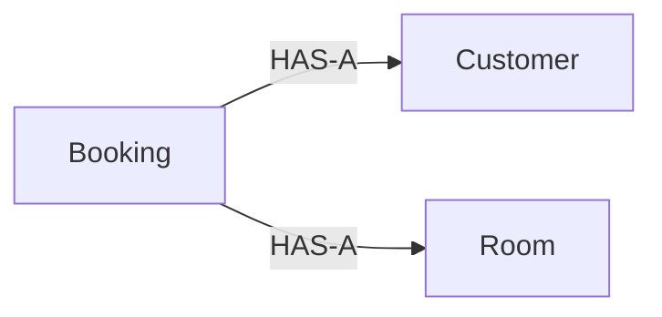

### 4. `Hotel`
The main management/business-logic class. It owns the collections of rooms, customers, and bookings, and exposes the operations that drive the entire system:

- Adding rooms
- Registering customers
- Booking rooms
- Cancelling bookings
- Generating bills

---

## 🧩 Class Diagram

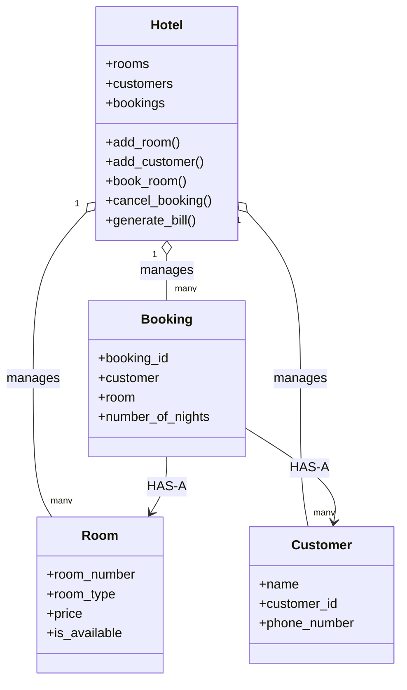

---

## 📋 Application Flow (CLI Menu)

When the program starts, the user is presented with the following menu:

```
==== Hotel Booking System ====

1. Add Room
2. Register Customer
3. View Available Rooms
4. Book Room
5. View Bookings
6. Cancel Booking
7. Generate Bill
8. Exit
```

---

## ⚙️ Feature Flows

### 1. Add Room
The user enters room number, type, and price. A `Room` object is created and added to the hotel's room list.

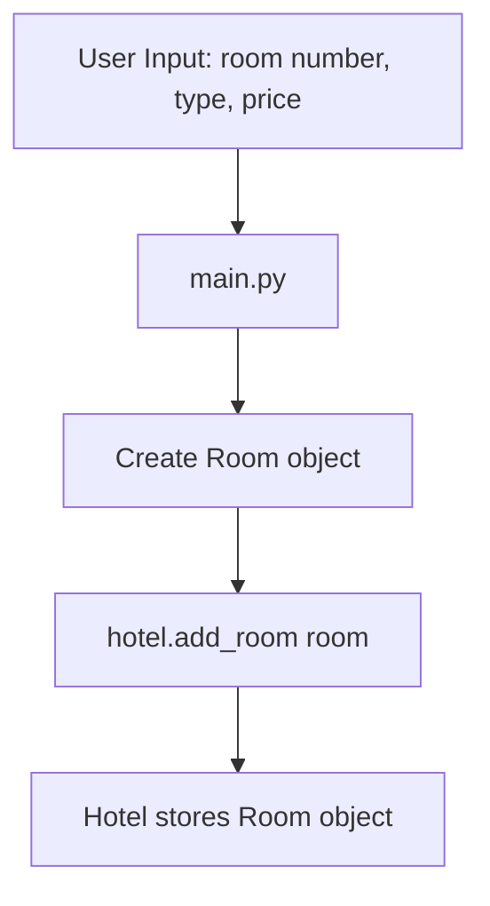

### 2. Register Customer
The user enters name, customer ID, and phone number. A `Customer` object is created and added to the hotel's customer list.

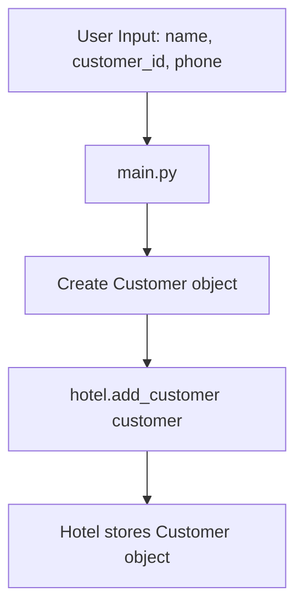

### 3. View Available Rooms
The system loops through all rooms and displays only those where `is_available == True`.

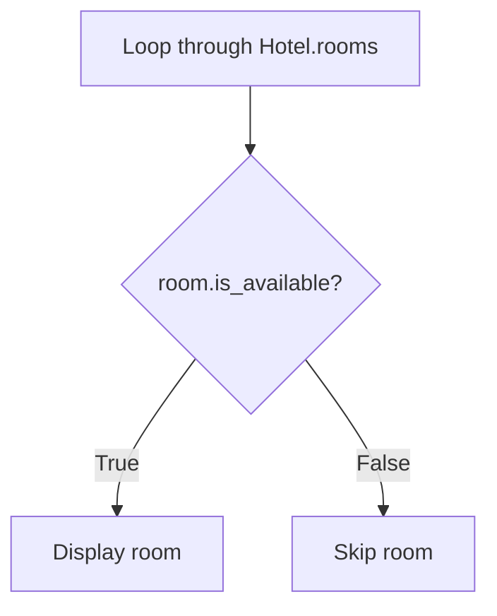

### 4. Book Room
The most complex flow — validates the customer and room, checks availability, then creates and stores the booking.

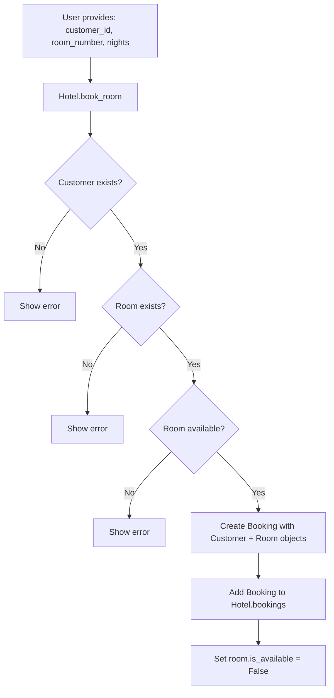

### 5. View Bookings
Loops through all bookings. Because `Booking` stores actual `Customer` and `Room` objects, related data is accessed directly through object references — demonstrating object composition and interaction.

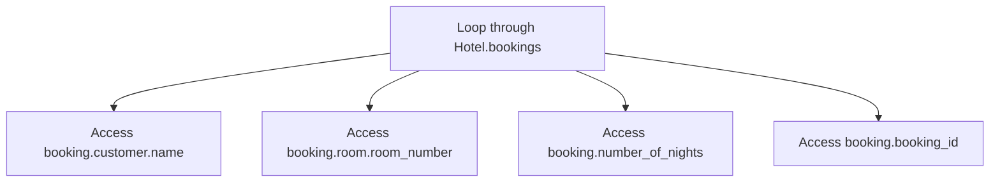

### 6. Cancel Booking
The user provides a booking ID. If found, the associated room is freed and the booking is removed.

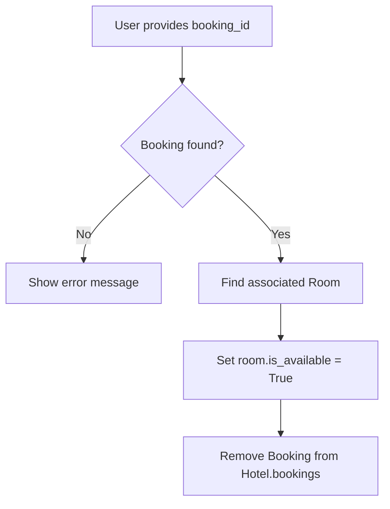

### 7. Generate Bill
The user provides a booking ID. The total is calculated as `room.price × number_of_nights`.

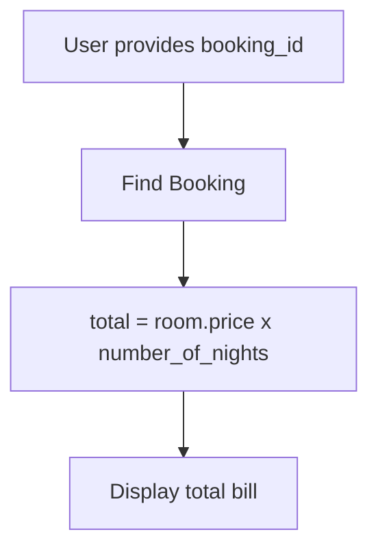

**Example:**
```
Room price  = ₹3000 / night
Nights      = 3
Total Bill  = ₹9000
```

### 8. Exit
Breaks out of the main `while` loop and terminates the program.

---

## 🧠 OOP Concepts Demonstrated

| Concept | Where it's applied |
|---|---|
| **Classes & Objects** | `Customer`, `Room`, `Booking`, `Hotel` are classes; individual customers/rooms/bookings are objects |
| **Encapsulation** | `Hotel` encapsulates core business operations (booking, cancellation, billing) |
| **Composition / HAS-A** | `Booking` HAS-A `Customer` and HAS-A `Room` — storing full objects instead of just IDs |
| **Object Interaction** | Objects communicate via attributes/methods (e.g., `booking.customer.name`) |
| **Separation of Responsibilities** | Each class has a single, well-defined role; `main.py` handles only CLI interaction |

---

## ⚠️ Current Limitations

- Data is stored **only in memory** — it does not persist between runs.
- **No database** integration yet.
- **No FastAPI / web layer** yet.
- **No frontend** yet.
- Validation and production-level error handling can be improved.
- Currently focused on **learning and demonstrating Python OOP**, not production deployment.

---

## 🚀 Future Roadmap

A FastAPI layer is planned **without replacing the existing OOP/business logic** — it will sit on top of it as an HTTP/API layer.

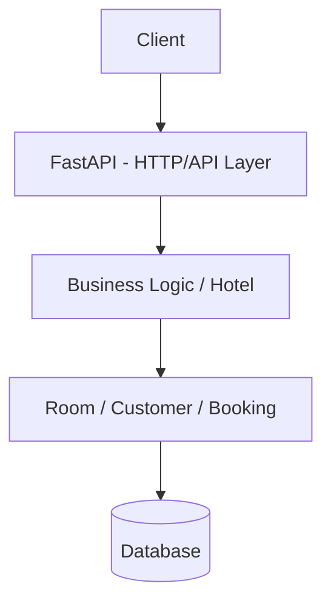

Planned enhancements:
- [ ] Integrate **FastAPI** as an API layer over the existing business logic
- [ ] Add **database persistence** (e.g., PostgreSQL / SQLite via SQLAlchemy)
- [ ] Add **authentication** for staff/admin access
- [ ] Build a **frontend** client (web or mobile) that consumes the API
- [ ] Strengthen **input validation** and error handling
- [ ] Add **unit tests** for core business logic

> **Note:** These are future extensions only — they are not currently implemented in the project.

---

## 🏁 Getting Started

### Prerequisites
- Python 3.x installed

### Installation

```bash
git clone https://github.com/KARTIK-KUMAR-SINGH/Hotel-Management-System-using-OOPs.git
cd Hotel-Management-System-using-OOPs
```

### Run the Application

```bash
python main.py
```

Follow the on-screen CLI menu to add rooms, register customers, and manage bookings.

---

## 🤝 Contributing

Contributions, issues, and feature requests are welcome. Feel free to check the [issues page](https://github.com/KARTIK-KUMAR-SINGH/Hotel-Management-System-using-OOPs/issues) or open a pull request.

1. Fork the project
2. Create your feature branch (`git checkout -b feature/AmazingFeature`)
3. Commit your changes (`git commit -m 'Add some AmazingFeature'`)
4. Push to the branch (`git push origin feature/AmazingFeature`)
5. Open a Pull Request

---

## 👤 Author

**Kartik Kumar Singh**
- GitHub: [@KARTIK-KUMAR-SINGH](https://github.com/KARTIK-KUMAR-SINGH)
- LinkedIn: [kartik-kumar-singh](https://www.linkedin.com/in/kartik-kumar-singh-a405b0306)

---

## 📄 License

This project is open source and available under the [MIT License](LICENSE).
